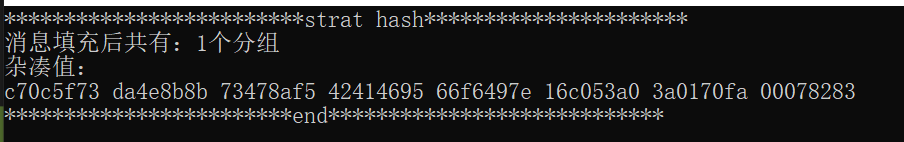
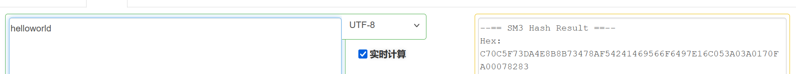
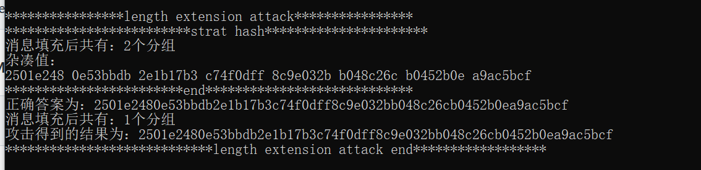

### 成员

未结组，独立完成

| 姓名   | 学号         | 账号 |
| ------ | ------------ | ---- |
| 杨一禾 | 202000460005 | nnfx |

### 项目完成情况

已完成：

SM3算法C++实现：SM3.cpp

长度扩展攻击：length_extension_attack.cpp

有问题：

生日攻击：birthday_attack.cpp

SM3算法的位数过大，个人计算机计算力不足，所以无法验证结果。

### 结果展示

#### SM3算法

用SM3算法对消息“helloworld”哈希，测试SM3算法正确性：

将得出的结果与在线加密工具得出的结果进行比较，发现结果一致，SM3算法正确。

#### 

#### 长度扩展攻击

两个的哈希值相同，故成功实现长度扩展攻击。

### 代码说明

代码和项目详细说明在SM3文件夹下的README中

### 运行方式

见文件夹内README文件

ps:抱歉我没能成功达到直接显示照片的效果，只能麻烦您从此目录下点击图片查看了

